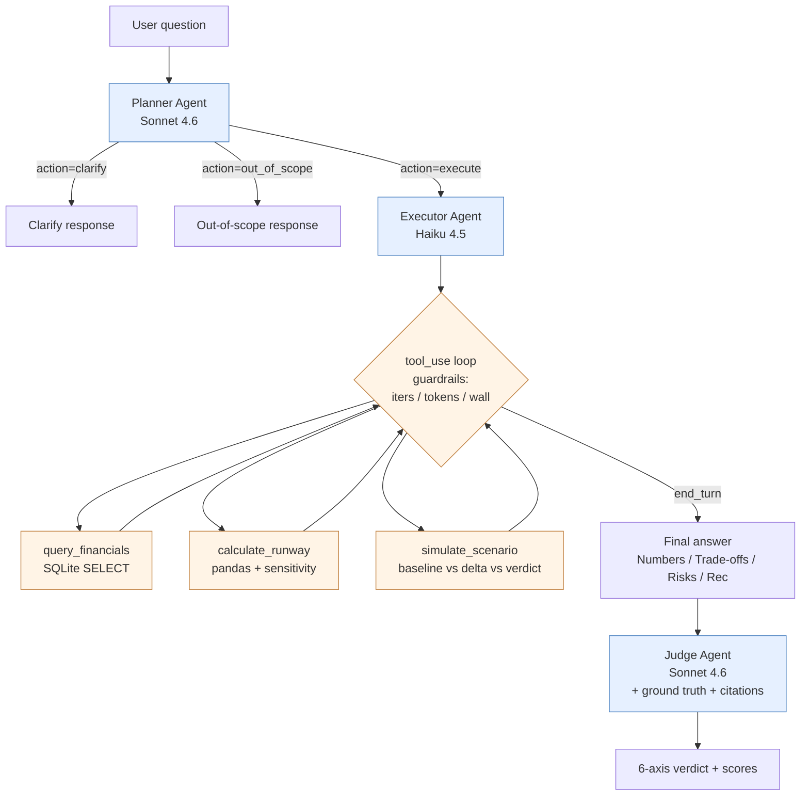

# Architecture & Decision Records — Cash Flow Runway Advisor

## 1. ADR-1 — Model Selection

**Decision.** Claude Sonnet 4.6 for the Planner and the Judge. Claude Haiku 4.5 for the Executor.

**Context.** A full evaluation sweep is roughly 50 tasks × (1 Planner call + ~4 Executor turns + 1 Judge call) ≈ 300 model calls; consistency adds 30 more. With three consistency runs × 50 variants, naïve Sonnet-everywhere pricing would dominate the burn budget.

**Reasoning.** Planning and grading are the two roles that hurt most when reasoning quality slips: a sloppy plan cascades into wasted tool calls, and a sloppy judge invalidates the entire evaluation matrix. Both are infrequent per task (one call each), so the Sonnet price tag is amortized. Execution, by contrast, is high-volume tool dispatch and short summarization once the plan is set — exactly where Haiku is strongest at ≈3× lower cost.

**Tradeoff.** Haiku occasionally formats the `<answer>` block more loosely than Sonnet would. The `EXECUTOR_SYSTEM_V3` prompt enforces required sections (Numbers / Trade-offs / Risks / Recommendation), and `_classify_success` rejects any output missing the `<answer>…</answer>` envelope, so format slips become failures we measure rather than slip past us.

---

## 2. ADR-2 — AI vs Rule-Based Components

| Component | LLM or Code? | Justification |
|---|---|---|
| Runway math | **Code** (`calculate_runway`) | Determinism, audit trail. An LLM doing arithmetic is a regression risk — small numbers, hard to catch. |
| Scenario math | **Code** (`simulate_scenario`) | Same. The LLM names the scenario; code computes baseline vs delta vs verdict. |
| Action enum | **Code** (`KNOWN_ACTIONS` whitelist) | Prevents the agent from inventing actions like `"raise_emergency_round"`. |
| Plan routing (`clarify` / `execute` / `out_of_scope`) | **LLM** (Planner) | Requires NL interpretation of vague intent — exactly what `if/else` can't do. |
| Risk synthesis | **LLM** (Executor `<Risks>` block) | Which uncertainty matters *for this user* is a semantic judgement (concentration vs seasonality vs one-off). |
| Success classification | **Code** (`_classify_success`) | Structural check on `<answer>` envelope + `stopped_reason`. We don't let the agent grade itself. |

---

## 3. ADR-3 — State Strategy

**Decision.** Stateless tasks. Every user question creates a fresh `Trace` and `CostTracker`. No conversation history carried across tasks.

**Context.** Cash-flow advice is decision-shot, not chat — a CFO asks one question, gets one cited recommendation, then acts. The product surface is closer to a calculator than to a chatbot.

**Why this beats full-history.** Carrying history risks the agent quoting a runway figure computed before the underlying data refreshed, or a scenario the user has already rejected. It also makes evaluation harder: per-task reproducibility requires that one task's behaviour not depend on another's trace.

**What we lose.** Follow-up questions ("what if it was $130k instead?") can't reference the prior calculation — they re-run. The cost is one extra Planner call, which our FinOps measurements show is ≈$0.002.

---

## 4. ADR-4 — Error Handling / Graceful Degradation

Three layers of defense, each independently sufficient:

1. **Tool layer.** Every tool returns `{status: 'error', error: ..., available: [...]}` rather than raising. The loop never crashes; the model reads the envelope and self-corrects. Empirically this kicks in most often on category-name casing (`"Marketing"` vs `"marketing"`) — the `available` list teaches the model the correct enum.

2. **Executor layer.** `EXECUTOR_SYSTEM_V3` explicitly instructs the model to read tool errors and either retry with corrected inputs or surface the gap to the user. Errors are *not* treated as task-fatal.

3. **Guardrail layer.** Hard kill switches: `max_iterations=7`, `max_total_tokens=60_000`, `max_wall_seconds=60`, `tool_timeout_s=10`. A trip yields `stopped_reason ∈ {max_iterations, token_budget, wall_clock}` and an explicit `guardrail` step in the trace. `_classify_success` marks these as failures so they don't contaminate the success-rate metric.

---

## 5. Architecture Diagram

**Legend.** Blue = LLM-driven nodes. Orange = deterministic Python.
